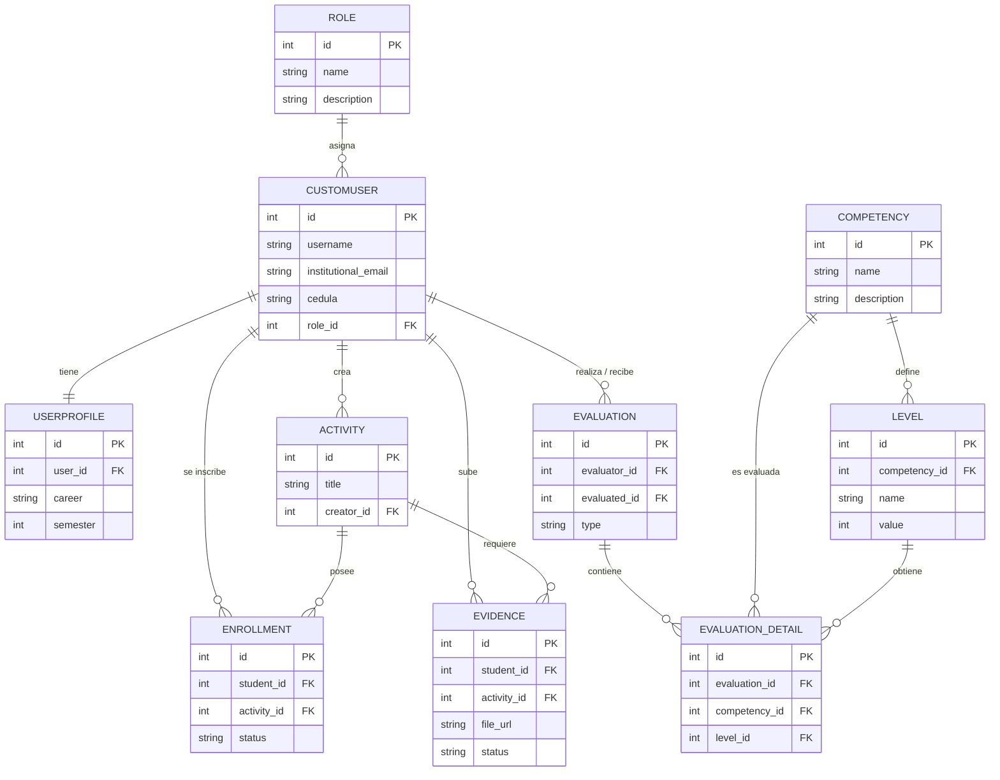

# Modelo de Datos: Habilidades Blandas

## 1. Modelo Entidad-Relación (ER)

El siguiente diagrama conceptual ilustra las entidades principales y cómo se relacionan entre los diferentes módulos (usuarios, competencias, actividades, evidencias y evaluaciones) dentro de la arquitectura Monolítica Modular.

## 2. Modelo Lógico

El modelo lógico se encuentra implementado a través del ORM de Django, respetando las restricciones de integridad relacional (Claves foráneas `FOREIGN KEY`, restricciones de unicidad `UNIQUE`, cascadas `ON DELETE CASCADE / SET NULL`).

*   **Esquema de Nomenclatura:** Las tablas en la base de datos se generan con el prefijo de la aplicación (módulo) seguido del nombre del modelo. Ej: `users_customuser`, `competencies_competency`.
*   **Restricciones de Dominio:** Los roles están delimitados por un enumerador de opciones (Ej. Estudiante, Docente). Los estados de las evidencias (Pendiente, Aprobado, Rechazado) se manejan mediante restricciones `CHECK` a nivel de base de datos gracias al ORM.
*   **Normalización:** El modelo cumple con la Tercera Forma Normal (3FN), evitando la redundancia de datos. La información específica del usuario (semestre, carrera) se separó en `UserProfile` para mantener la tabla de autenticación `CustomUser` ligera.

## 3. Scripts SQL de Creación (DDL)

El script SQL completo y exacto para la creación de la base de datos PostgreSQL, incluyendo todas las restricciones, índices y tablas generadas por Django, se ha exportado exitosamente de tu contenedor Docker en el archivo adjunto en la raíz de tu proyecto:

👉 **[Ver archivo schema.sql](file:///D:/Programacion/Sistema_Academico/schema.sql)**

*Nota: Este archivo fue generado directamente desde el contenedor de base de datos en ejecución utilizando `pg_dump`, por lo que representa el estado 100% real de la base de datos `academico_db`.*
